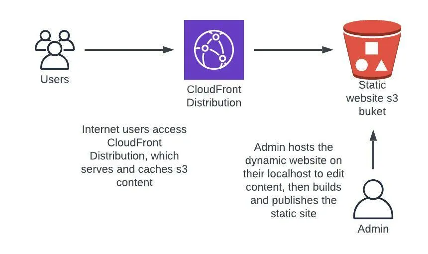

Every year, my shared hosting bill made me wonder if it’s worth renewing.

A few hundred dollars is fair for what most shared hosting companies provide, but it‘s hard to justify when all
you’re running is a few hobby sites that don’t change much, don’t have user logins, and don’t make much money.

For example, my photography website was a Symfony application running on JustHost’s “Plus” plan for $14.99 a month .
That price provides space on a shared Linux server running Apache, PHP, and MySQL, which the application needed to
serve traffic and let me author its content.

In reality, sites like that could just as well be a collection of cheaply hosted static HTML files instead of a
website run on a LAMP stack costing about $200/year. But I just don’t want to sacrifice using Symfony. The Twig
templating engine makes building webpages a pleasure, and bundles like Sonata Admin makes authoring the site’s
content a breeze. I don’t want to get stuck writing HTML myself.

Luckily, there are some great solutions. Here’s mine:

1. I used a static site generator to build a static site from my Symfony site,
2. hosted the site on AWS S3 behind a CloudFront distribution, and
3. built a deployment process to automate it all whenever I author or change the content.

Here’s the how-to, step by step:

## Step 1: Use a static site generator to create your static website

I used <a href="https://stenopephp.github.io/Stenope/" target="_blank">Stenope</a> to generate the static site from
my Symfony site. Stenope crawls your Symfony site and builds a static version of it as it exists at that time.

You can use any site generator that suits your needs. There’s a good list at jamstack.org/generators.

If you use Stenope, install it with:

```bash
composer require stenope/stenope
```

Then build the static site with:

```bash
bin/console -e prod stenope:build ./static
```

This will build the site and put the resulting HTML files and assets in a directory named `static`.

Each of your website’s routes will be its own directory holding an index.html file. As long as you can ensure those
document indexes are displayed by default, all your existing routes will work as usual (e.g. “/blog/123” should
respond with the generated file “/blog/123/index.html”).

## Step 2: Create your AWS infrastructure

Next you’ll need to create a place to host your site. I use AWS for its ease and low cost (well, low cost for this
particular purpose).

Here’s what we want:

1. An s3 bucket that will store the static website code
2. A CloudFront distribution to make serving the site fast anywhere
3. A domain name for the site, pointing to that CloudFront distribution

<figure>
    
    <figcaption>Basic infrastructure for static site updates</figcaption>
</figure>

For my site, I did #1 and #2 with a CloudFormation template. It’s always worth describing your infrastructure as
code in case you need to pick it up and put it in another account, or just reset things to a working earlier version.

Here’s that template:

```yaml
# static-website.yaml
Resources:
  WebsiteBucket:
    Type: AWS::S3::Bucket
    Properties:
      BucketName: YOUR-BUCKET-NAME
      AccessControl: Private

  WebsiteBucketPolicy:
    Type: AWS::S3::BucketPolicy
    Properties:
      Bucket: !Ref WebsiteBucket
      PolicyDocument:
        Statement:
          - Action: s3:GetObject
            Effect: Allow
            Resource: !Sub 'arn:aws:s3:::${WebsiteBucket}/*'
            Principal:
              AWS:
                - !Sub "arn:aws:iam::cloudfront:user/CloudFront Origin Access Identity ${DistributionOAI.Id}"

  DistributionOAI:
    Type: AWS::CloudFront::CloudFrontOriginAccessIdentity
    Properties:
      CloudFrontOriginAccessIdentityConfig:
        Comment: 'OAI for CloudFront access to s3'

  Distribution:
    Type: AWS::CloudFront::Distribution
    Properties:
      DistributionConfig:
        Origins:
          - DomainName: !GetAtt WebsiteBucket.RegionalDomainName
            Id: 's3-origin'
            S3OriginConfig:
              OriginAccessIdentity: !Sub "origin-access-identity/cloudfront/${DistributionOAI.Id}"
        PriceClass: PriceClass_100
        Enabled: true
        DefaultCacheBehavior:
          TargetOriginId: 's3-origin'
          ViewerProtocolPolicy: 'redirect-to-https'
          FunctionAssociations:
            - EventType: viewer-request
              FunctionARN: !GetAtt RewriteDefaultIndexRequest.FunctionMetadata.FunctionARN
          ForwardedValues:
            QueryString: 'false'
            Cookies:
              Forward: all

  RewriteDefaultIndexRequest:
    Type: AWS::CloudFront::Function
    Properties:
      Name: RewriteDefaultIndexRequest
      AutoPublish: true
      FunctionCode: |
        function handler(event) {
          var request = event.request;
          var uri = request.uri;
          if (uri.endsWith('/')) {
            request.uri += 'index.html';
          }
          else if (!uri.includes('.')) {
            request.uri += '/index.html';
          }
          return request;
        }
      FunctionConfig:
        Comment: 'Add document indexes to requests'
        Runtime: cloudfront-js-1.0
```

Some notes on that infrastructure:

**Distribution pricing**: For the CloudFront Distribution, I opted for the “PriceClass_100” PriceClass. That’s the
cheapest option for the CDN, which caches your site in North America and Europe.

**Serving index.html**: Since this site isn’t hosted on a traditional web server, we have to tell it to serve, say,
“/about/index.html” when a user goes to “/about” in their browser. That’s done with the code you see in the
“RewriteDefaultIndexRequest” CloudFront Function.

**Bucket privacy**: The site’s s3 bucket is private. Only the CloudFront distribution can read from it, using the
“DistributionOAI” origin access identity.

## Step 3: Build and upload your static website

Since this website needs to rebuild and redeploy itself (or parts of itself) every time content changes, that
process needs to be repeatable. Tie everything together with a deployment script like this one:

```bash
#!/bin/bash -e

# Deploy the website infrastructure
aws cloudformation deploy \
  --template-file static-website.yaml \
  --stack-name my-website-prod \
  --region us-east-1 \
  --no-fail-on-empty-changeset

# Build the static website
bin/console -e prod cache:clear
bin/console -e prod stenope:build ./static

# Sync the built site to s3
aws s3 sync ./static/ s3://YOUR-BUCKET-NAME --delete
```

This uses the aws cli to deploy the CloudFormation stack for the infrastructure (which I do every deployment because
it doesn’t hurt and I believe services should be responsible for their own resources [well, mostly]), then builds a
new version of the static website with Stenope, and finally uploads that build to the s3 bucket using aws s3 sync.

If you wanted to go a step further, you could then create a new cache invalidation for the CloudFront distribution
to invalidate the cached versions of the newly updated s3 objects.

This script could be run automatically every time you make a content change, or manually whenever you want to push
updates.

## Ta-da!

You now have a fast and secure website, hosted dirt cheap on a platform you don’t have to think about.

Read on for more considerations.

### Adding a domain name

You may want to use a custom domain name for your site instead of the gobbledygook generated by CloudFront.

To do that, follow these steps:

1. Register your domain in Route53, create an SSL certificate in ACM, and validate the certificate for the domain
2. Add “Aliases” and “ViewerCertificate” to your distribution’s “DistributionConfig” in the CloudFormation template (see below).
3. Follow the steps here for adding Alias records to your domain’s hosted zone.

```diff
 Distribution:
   Properties:
     DistributionConfig:
+      Aliases: [ YOUR-DOMAIN.com ]
+      ViewerCertificate:
+        AcmCertificateArn: ARN-OF-YOUR-ACM-CERT-FOR-YOUR-DOMAIN
+        MinimumProtocolVersion: TLSv1
+        SslSupportMethod: sni-only
```

A .com domain through Route 53 will add $12 annually, plus $0.50 per month for the hosted zone totaling $18 per year.

### Jamstack

There’s nothing preventing you from adding JavaScript to your pages that makes API calls out to various services. In
fact, that would be the final part of the Jamstack (JavaScript, APIs, Markup) architecture.

Examples include adding a comments section to your static pages with Disqus, or showing the day’s forecast using the
OpenWeather API.

And of course you can write your own API called by your static site, and serve that API on, say, Lambda via API
Gateway. At that point the cost savings benefit falls short, but separating static frontend assets (webpages and
related files) from your backend (API) is a worthy endeavor nonetheless.

### SPAs

If you want to adopt this strategy to host single-page applications written in React, Vue, or another JS framework,
just update the CloudFormation function from Step 2 (“RewriteDefaultIndexRequest”).

Your update would make all requests that aren’t for a specific resource (like an image) return your application’s
entrypoint HTML file instead. Then you can handle routing in your SPA, knowing that anyone who lands on a different
route will still get served the application.

---

By rethinking your stack a little bit, you may find you have sites that can be statically built and rebuilt when
necessary. That can make them faster, cheaper, and more available — pleasing your users, while taking a burden off
your wallet.
